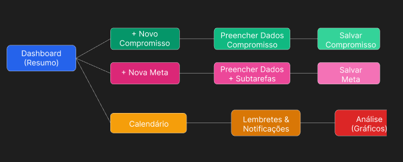

# Projeto de Interface

O **CHRONOS** é uma plataforma web de agenda inteligente que organiza atividades, compromissos e metas pessoais.  
Seu objetivo é fornecer uma solução prática e intuitiva para melhorar a produtividade, reduzir esquecimentos e apoiar o planejamento da rotina de seus usuários.

## User Flow

## Principais Interfaces da Plataforma

### 1. Dashboard (Tela Inicial)
- Resumo diário/semanal com compromissos próximos.
- Metas em andamento e gráfico rápido de produtividade.
- Atalhos para criar novas atividades e metas.
- Menu lateral para navegação global (Início, Buscar, Calendário, Rotina, Metas, Lembretes, Conquistas e Projetos).

### 2. Tela de Calendário
- Visualização em **Lista, Semana, Mês ou Kanban**.
- Permite arrastar e soltar compromissos para reorganização.
- Filtros por cores/categorias para facilitar a identificação.

### 3. Tela de Metas
- Criação de metas com possibilidade de subdivisão em subtarefas.
- Acompanhamento visual de progresso (percentual).
- Destaque para metas próximas do prazo.

### 4. Tela de Lembretes & Notificações
- Notificações antes dos compromissos.
- Alertas automáticos sobre metas a vencer.

### 5. Tela de Análise
- Gráficos de produtividade (tarefas concluídas x planejadas).
- Distribuição de tempo por categorias (ex.: estudo, trabalho, lazer).
- Linha do tempo de evolução de metas.
- Resumos semanais e mensais.

## Wireframes

Os wireframes foram desenvolvidos a partir dos requisitos funcionais e das histórias de usuário previamente levantados, assegurando clareza na navegação e alinhamento com os objetivos do sistema.  

Para melhor visualização e interação, os protótipos estão disponíveis no **Figma**, por meio do link a seguir:  

🔗 [Acessar Wireframes no Figma](https://www.figma.com/design/xJNxgkDoBsvZR3w9nxGZEf/Trabalho?node-id=0-1&t=k497y7ou3rOmCltb-1)  